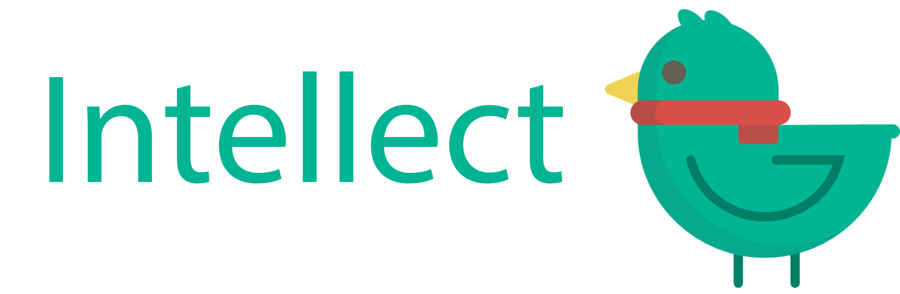

# Intellect
A Brainly alternate built with Node.js and MongoDB
# Logo
[Source image](https://www.shareicon.net/animal-bird-zoo-animals-ornithology-859329)

Colors:
 * Green:  rgb(0,187,151)
 * Red:    rgb(235,56,55)
 * Yellow: rgb(242,215,71)
 * Grey:   rgb(99,97,81)
# Todo
 *
# Inventory of the bucket
Here are some ideas and a place to put stuff while we think about it
  * Loading bar
    * Has colors from icon
    * Simple, pure css
